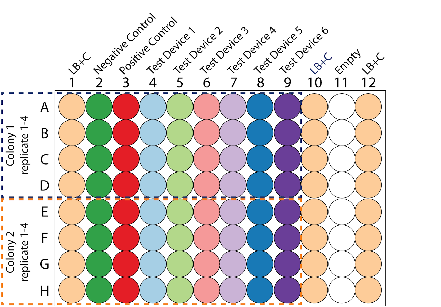

# Cell measurement protocol

This year we plan to go towards automation, where a 96-well plate instead of a tube is used for culturing. Prior to the full establishment of this protocol, we need to evaluate how the performance is worldwide with this as well as with parallel experiment in the test tube, which has been used as standard culturing protocol.

At the end of the experiment, you would have two plates to be measured (five for challenging version). You will measure both fluorescence and absorbance in each plate.

Prior to performing the cell measurements you should perform all three of the calibration measurements. Please do not proceed unless you have completed the three calibration protocols. Completion of the calibrations will ensure that you understand the measurement process and that you can take the cell measurements under the same conditions. For the sake of consistency and reproducibility, we are requiring all teams to use E. coli K-12 DH5-alpha. If you do not have access to this strain, you can request streaks of the transformed devices from another team near you, and this can count as a collaboration as long as it is appropriately documented on both teams' wikis. If you are absolutely unable to obtain the DH5-alpha strain, you may still participate in the InterLab study by contacting the Measurement Committee (measurement at igem dot org) to discuss your situation.

For all of these cell measurements, you must use the same plates and volumes that you used in your calibration protocol. You must also use the same settings (e.g., filters or excitation and emission wavelengths) that you used in your calibration measurements. If you do not use the same plates, volumes, and settings, the measurements will not be valid.

## Protocol Outputs:
* `baseline absorbance of culture (day 2) measurements of cultures (0 hr timepoint)`
* `0 hr absorbance timepoint measurements of plate 1`
* `0 hr fluorescence timepoint measurements of plate 1`
* `6 hr absorbance timepoint measurements of plate 1`
* `6 hr fluorescence timepoint measurements of plate 1`
* `6 hr absorbance timepoint measurements of plate 2`
* `6 hr fluorescence timepoint measurements of plate 2`

## Protocol Materials:
* [_E. coli_ DH5 alpha](https://identifiers.org/taxonomy:668369)
* [LB Broth + Chloramphenicol]()
* [LB Agar + Chloramphenicol]()
* [Chloramphenicol](https://pubchem.ncbi.nlm.nih.gov/compound/5959)
* [Negative control](http://parts.igem.org/Part:BBa_J428100)
* [Positive control (I20270)](http://parts.igem.org/Part:BBa_I20270)
* [Test Device 1 (J364000)](http://parts.igem.org/Part:BBa_J364000)
* [Test Device 2 (J36401)](http://parts.igem.org/Part:BBa_J364001)
* [Test Device 3 (J36402)](http://parts.igem.org/Part:BBa_J364002)
* [Test Device 4 (J364007)](http://parts.igem.org/Part:BBa_J364007)
* [Test Device 5 (J364008)](http://parts.igem.org/Part:BBa_J364008)
* [Test Device 6 (J364009)](http://parts.igem.org/Part:BBa_J364009)

#### Part Locations in Distribution Kit
| Part | Coordinate |
| ---- | -------------- |
|BBa_J428100|Kit Plate 1 Well 12M|
|BBa_I20270|Kit Plate 1 Well 1A|
|BBa_J364000|Kit Plate 1 Well 1C|
|BBa_J364001|Kit Plate 1 Well 1E|
|BBa_J364002|Kit Plate 1 Well 1G|
|BBa_J364007|Kit Plate 1 Well 1I|
|BBa_J364008|Kit Plate 1 Well 1K|
|BBa_J364009|Kit Plate 1 Well 1M|

## Protocol Steps:
1. Provision 8 x culture plate containing LB Agar + Chloramphenicol growth medium for culturing `test strains`
2. Transform `Negative control` DNA into _`E. coli`_ ` DH5 alpha` and plate transformants on LB Broth + Chloramphenicol. Repeat for the remaining transformant DNA:  `Positive control (I20270)`, `Test Device 1 (J364000)`, `Test Device 2 (J36401)`, `Test Device 3 (J36402)`, `Test Device 4 (J364007)`, `Test Device 5 (J364008)`, and `Test Device 6 (J364009)`. Plate transformants on `test strains` plates.
3. Provision 16 x culture tubes to contain `culture (day 1)`
4. Pick 2 colonies from each `test strains` plate.
5. Inoculate 2 colonies of each transformant test strains, for a total of 16 cultures. Inoculate each into 5.0 milliliter of LB Broth + Chloramphenicol in culture (day 1) and grow for 16.0 hour at 37.0 degree Celsius and 220.0 rpm.
6. Provision 16 x culture tubes to contain `culture (day 2)`
7. Dilute each of 16 `culture (day 1)` samples with LB Broth + Chloramphenicol into the culture tube at a 1:10 ratio and final volume of 5.0 milliliter. Maintain at 4.0 degree Celsius while performing dilutions.
8. Provision 16 x 1.5 mL microfuge tubes to contain `cultures (0 hr timepoint)`
9. Hold `cultures (0 hr timepoint)` at 4.0 degree Celsius. This will prevent cell growth while transferring samples.
10. Transfer 1.0 milliliter of each of 16 `culture (day 2)` samples to 1.5 mL microfuge tube containers to contain a total of 16 `cultures (0 hr timepoint)` samples. Maintain at 4.0 degree Celsius during transfer.
11. Measure baseline absorbance of culture (day 2) of `cultures (0 hr timepoint)` at 600.0 nanometer.
12. Provision 16 x 50 ml conical tubes to contain `back-diluted culture` The conical tube should be opaque, amber-colored, or covered with foil.
13. Back-dilute each of 16 `culture (day 2)` samples to a target OD of 0.02 using LB Broth + Chloramphenicol as diluent to a final volume of 12.0 milliliter. Maintain at 4.0 degree Celsius while performing dilutions.

14. Provision 16 x 1.5 mL microfuge tubes to contain `back-diluted culture aliquots`
15. Hold `back-diluted culture aliquots` at 4.0 degree Celsius. This will prevent cell growth while transferring samples.
16. Transfer 1.0 milliliter of each of 16 `back-diluted culture` samples to 1.5 mL microfuge tube containers to contain a total of 16 `back-diluted culture aliquots` samples. Maintain at 4.0 degree Celsius during transfer.
17. Provision a 96 well microplate to contain `plate 1`
18. Hold `plate 1` at 4.0 degree Celsius.
19. Transfer 200.0 microliter of each `back-diluted culture aliquots` sample to 96 well microplate `plate 1` in the wells indicated in the plate layout.
 Maintain at 4.0 degree Celsius during transfer.
20. Transfer 200.0 microliter of `LB Broth + Chloramphenicol` sample to wells A1:H1, A10:H10, A12:H12 of  96 well microplate `plate 1`. Maintain at 4.0 degree Celsius during transfer. These samples are blanks.

21. Measure 0 hr absorbance timepoint of `plate 1` at 600.0 nanometer.
22. Measure 0 hr fluorescence timepoint of `plate 1` with excitation wavelength of 488.0 nanometer and emission filter of 530.0 nanometer and 30.0 nanometer bandpass.
23. Cover `plate 1` samples in 96 well microplate with your choice of material to prevent evaporation.
24. Incubate all `back-diluted culture` samples for 6.0 hour at 37.0 degree Celsius at 220.0 rpm.
25. Incubate all `plate 1` samples for 6.0 hour at 37.0 degree Celsius at 220.0 rpm.
26. Hold all `back-diluted culture` samples at 4.0 degree Celsius. This will inhibit cell growth during the subsequent pipetting steps.
27. Hold all `plate 1` samples at 4.0 degree Celsius. This will inhibit cell growth during the subsequent pipetting steps.
28. Provision a 96 well microplate to contain `plate 2`
29. Hold `plate 2` at 4.0 degree Celsius.
30. Transfer 200.0 microliter of each `back-diluted culture` sample to 96 well microplate `plate 2` in the wells indicated in the plate layout.
 Maintain at 4.0 degree Celsius during transfer.
31. Transfer 200.0 microliter of `LB Broth + Chloramphenicol` sample to wells A1:H1, A10:H10, A12:H12 of  96 well microplate `plate 2`. Maintain at 4.0 degree Celsius during transfer. These are the blanks.
32. Measure 6 hr absorbance timepoint of `plate 1` at 600.0 nanometer.
33. Measure 6 hr fluorescence timepoint of `plate 1` with excitation wavelength of 485.0 nanometer and emission filter of 530.0 nanometer and 30.0 nanometer bandpass.
34. Measure 6 hr absorbance timepoint of `plate 2` at 600.0 nanometer.
35. Measure 6 hr fluorescence timepoint of `plate 2` with excitation wavelength of 485.0 nanometer and emission filter of 530.0 nanometer and 30.0 nanometer bandpass.
36. Import data for `baseline absorbance of culture (day 2) measurements of cultures (0 hr timepoint)`, `0 hr absorbance timepoint measurements of plate 1`, `0 hr fluorescence timepoint measurements of plate 1`, `6 hr absorbance timepoint measurements of plate 1`, `6 hr fluorescence timepoint measurements of plate 1`, `6 hr absorbance timepoint measurements of plate 2`, `6 hr fluorescence timepoint measurements of plate 2` into provided Excel file.
---
Timestamp: 2022-06-28 21:50:46.276394---
Protocol version: 1.0b