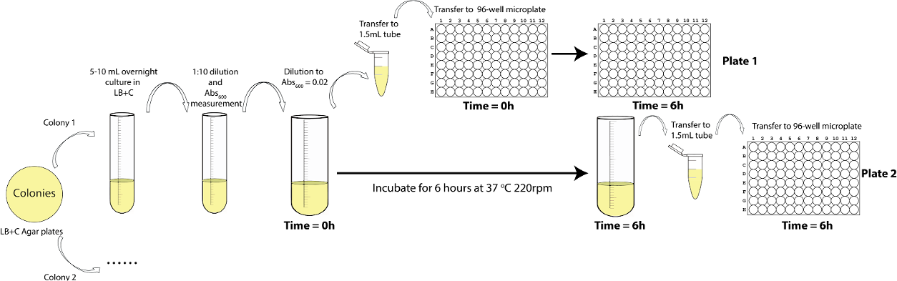
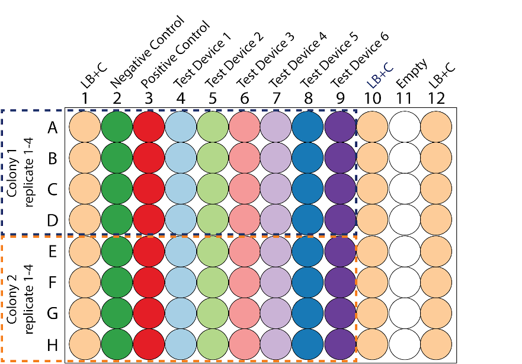

# Testing the three color calibration protocol

In this experiment, your team will measure the fluorescence of six devices that encode either a single fluorescence protein (blue, green, or red) or two fluorescence proteins encoded in two transcriptional units. You will calibrate the fluorescence of these devices to the three calibrant dyes and you will calibrate the optical density of the culture to the cell density calibrant.

This experiment aims to assess the lab-to-lab reproducibility of the new three color calibration protocol. We will test if it works well for calibrating the fluorescence in cells that express one single fluorescent protein and for cells expressing two different fluorescent proteins at the same time.

## Protocol Outputs:
* `baseline absorbance of culture (day 2) measurements of cultures (0 hr timepoint)`
* `0 hr absorbance timepoint measurements of plate 1`
* `0 hr green fluorescence timepoint measurements of plate 1`
* `0 hr blue fluorescence timepoint measurements of plate 1`
* `0 hr red fluorescence timepoint measurements of plate 1`
* `6 hr absorbance timepoint measurements of plate 2`
* `6 hr green fluorescence timepoint measurements of plate 2`
* `6 hr blue fluorescence timepoint measurements of plate 2`
* `6 hr red fluorescence timepoint measurements of plate 2`

## Protocol Materials:
* [_E. coli_ DH5 alpha](https://identifiers.org/pubchem.substance:24901740)
* [LB Broth+chloramphenicol](https://identifiers.org/pubchem.substance:24901740)
* [chloramphenicol](https://identifiers.org/pubchem.substance:24901740)
* [Negative control 2022](http://parts.igem.org/Part:BBa_J428100)
* [Positive control 2018](http://parts.igem.org/Part:BBa_I20270)
* [Test Device 1 Exp 1 (Green Device)](http://parts.igem.org/Part:BBa_J428112)
* [Test Device 2 Exp 1 (Red mRFP1 device)](http://parts.igem.org/Part:BBa_J428110)
* [Test Device 3 Exp 1 (Red mCherry device)](http://parts.igem.org/Part:BBa_J428111)
* [Test Device 4 Exp 1 (RiboJ Insulated mCherry device)](http://parts.igem.org/Part:BBa_J428101)
* [Test Device 5 Exp 1 (Dual construct Blue and Red)](http://parts.igem.org/Part:BBa_J428108)
* [Test Device 6 Exp 1 (Dual construct Green and Red)](http://parts.igem.org/Part:BBa_J428106)

#### Part Locations in Distribution Kit
| Part | Coordinate |
| ---- | -------------- |
|BBa_J428100|Kit Plate 1 Well 12M|
|BBa_I20270|Kit Plate 1 Well 1A|
|BBa_J428112|Kit Plate 1 Well 14C|
|BBa_J428110|Kit Plate 1 Well 12O|
|BBa_J428111|Kit Plate 1 Well 14A|
|BBa_J428101|Kit Plate 1 Well 12I|
|BBa_J428108|Kit Plate 1 Well 14E|
|BBa_J428106|Kit Plate 1 Well 12G|

## Protocol Steps:
1. Transform `Negative control 2022` DNA into _`E. coli`_ ` DH5 alpha` and plate transformants on LB Broth+chloramphenicol. Repeat for the remaining transformant DNA:  `Positive control 2018`, `Test Device 1 Exp 1 (Green Device)`, `Test Device 2 Exp 1 (Red mRFP1 device)`, `Test Device 3 Exp 1 (Red mCherry device)`, `Test Device 4 Exp 1 (RiboJ Insulated mCherry device)`, `Test Device 5 Exp 1 (Dual construct Blue and Red)`, and `Test Device 6 Exp 1 (Dual construct Green and Red)`.
2. Provision 16 x culture tubes to contain `culture (day 1)`
3. Inoculate _`E. coli`_ ` DH5 alpha+Negative control 2022 transformant` into 5.0 milliliter of LB Broth+chloramphenicol in culture (day 1) and grow for 16.0 hour at 37.0 degree Celsius and 220.0 rpm.  Repeat this procedure for the other inocula:  _`E. coli`_ ` DH5 alpha+Positive control 2018 transformant`, _`E. coli`_ ` DH5 alpha+Test Device 1 Exp 1 (Green Device) transformant`, _`E. coli`_ ` DH5 alpha+Test Device 2 Exp 1 (Red mRFP1 device) transformant`, _`E. coli`_ ` DH5 alpha+Test Device 3 Exp 1 (Red mCherry device) transformant`, _`E. coli`_ ` DH5 alpha+Test Device 4 Exp 1 (RiboJ Insulated mCherry device) transformant`, _`E. coli`_ ` DH5 alpha+Test Device 5 Exp 1 (Dual construct Blue and Red) transformant`, and _`E. coli`_ ` DH5 alpha+Test Device 6 Exp 1 (Dual construct Green and Red) transformant`. Inoculate 2 replicates for each transformant, for a total of 16 cultures.
4. Provision 16 x culture tubes to contain `culture (day 2)`
5. Dilute each of 16 `culture (day 1)` samples with LB Broth+chloramphenicol into the culture tube at a 1:10 ratio and final volume of 5.0 milliliter. Maintain at 4.0 degree Celsius while performing dilutions.
6. Provision 16 x 1.5 mL microfuge tubes to contain `cultures (0 hr timepoint)`
7. Hold `cultures (0 hr timepoint)` at 4.0 degree Celsius. This will prevent cell growth while transferring samples.
8. Transfer 1.0 milliliter of each of 16 `culture (day 2)` samples to 1.5 mL microfuge tube containers to contain a total of 16 `cultures (0 hr timepoint)` samples. Maintain at 4.0 degree Celsius during transfer.
9. Measure baseline absorbance of culture (day 2) of `cultures (0 hr timepoint)` at 600.0 nanometer.
10. Provision 16 x 50 ml conical tubes to contain `back-diluted culture` The conical tube should be opaque, amber-colored, or covered with foil.
11. Back-dilute each of 16 `culture (day 2)` samples to a target OD of 0.02 using LB Broth+chloramphenicol as diluent to a final volume of 12.0 milliliter. Maintain at 4.0 degree Celsius while performing dilutions.

12. Provision 16 x 1.5 mL microfuge tubes to contain `back-diluted culture aliquots`
13. Hold `back-diluted culture aliquots` at 4.0 degree Celsius. This will prevent cell growth while transferring samples.
14. Transfer 1.0 milliliter of each of 16 `back-diluted culture` samples to 1.5 mL microfuge tube containers to contain a total of 16 `back-diluted culture aliquots` samples. Maintain at 4.0 degree Celsius during transfer.
15. Provision a 96 well microplate to contain `plate 1`
16. Hold `plate 1` at 4.0 degree Celsius.
17. Transfer 100.0 microliter of each `cultures (0 hr timepoint)` sample to 96 well microplate `plate 1` in the wells indicated in the plate layout.
 Maintain at 4.0 degree Celsius during transfer.
18. Transfer 100.0 microliter of `LB Broth+chloramphenicol` sample to wells A1:H1, A10:H10, A12:H12 of  96 well microplate `plate 1`. Maintain at 4.0 degree Celsius during transfer. These samples are blanks.

19. Measure 0 hr absorbance timepoint of `plate 1` at 600.0 nanometer.
20. Measure 0 hr green fluorescence timepoint of `plate 1` with excitation wavelength of 488.0 nanometer and emission filter of 530.0 nanometer and 30.0 nanometer bandpass.
21. Measure 0 hr blue fluorescence timepoint of `plate 1` with excitation wavelength of 405.0 nanometer and emission filter of 450.0 nanometer and 50.0 nanometer bandpass.
22. Measure 0 hr red fluorescence timepoint of `plate 1` with excitation wavelength of 561.0 nanometer and emission filter of 610.0 nanometer and 20.0 nanometer bandpass.
23. Incubate all `back-diluted culture` samples for 6.0 hour at 37.0 degree Celsius at 220.0 rpm.
24. Hold all `cultures (0 hr timepoint)` samples at 4.0 degree Celsius. This will inhibit cell growth during the subsequent pipetting steps.
25. Provision 16 x 1.5 mL microfuge tubes to contain `6hr timepoint`
26. Provision a 96 well microplate to contain `plate 2`
27. Hold `6hr timepoint` at 4.0 degree Celsius. This will prevent cell growth while transferring samples.
28. Hold `plate 2` at 4.0 degree Celsius.
29. Transfer 1.0 milliliter of each of 16 `back-diluted culture` samples to 1.5 mL microfuge tube containers to contain a total of 16 `6hr timepoint` samples. Maintain at 4.0 degree Celsius during transfer.
30. Transfer 100.0 microliter of each `6hr timepoint` sample to 96 well microplate `plate 2` in the wells indicated in the plate layout.
 Maintain at 4.0 degree Celsius during transfer.
31. Transfer 100.0 microliter of `LB Broth+chloramphenicol` sample to wells A1:H1, A10:H10, A12:H12 of  96 well microplate `plate 2`. Maintain at 4.0 degree Celsius during transfer. These are the blanks.
32. Measure 6 hr absorbance timepoint of `plate 2` at 600.0 nanometer.
33. Measure 6 hr green fluorescence timepoint of `plate 2` with excitation wavelength of 485.0 nanometer and emission filter of 530.0 nanometer and 30.0 nanometer bandpass.
34. Measure 6 hr blue fluorescence timepoint of `plate 2` with excitation wavelength of 405.0 nanometer and emission filter of 450.0 nanometer and 50.0 nanometer bandpass.
35. Measure 6 hr red fluorescence timepoint of `plate 2` with excitation wavelength of 561.0 nanometer and emission filter of 610.0 nanometer and 20.0 nanometer bandpass.
36. Import data for `baseline absorbance of culture (day 2) measurements of cultures (0 hr timepoint)`, `0 hr absorbance timepoint measurements of plate 1`, `0 hr green fluorescence timepoint measurements of plate 1`, `0 hr blue fluorescence timepoint measurements of plate 1`, `0 hr red fluorescence timepoint measurements of plate 1`, `6 hr absorbance timepoint measurements of plate 2`, `6 hr green fluorescence timepoint measurements of plate 2`, `6 hr blue fluorescence timepoint measurements of plate 2`, `6 hr red fluorescence timepoint measurements of plate 2` into provided Excel file.
---
Timestamp: 2022-06-27 08:14:26.010060---
Protocol version: 1.0b