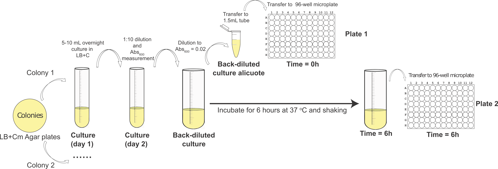

# MINI Interlab - Testing the three color calibration protocol

In this experiment, your team will measure the fluorescence of six devices that encode a single fluorescence protein (blue, green, or red). You will calibrate the fluorescence of these devices to the three calibrant dyes and you will calibrate the optical density of the culture to the cell density calibrant.

This experiment aims to assess the lab-to-lab reproducibility of the new three color calibration protocol. We will test if it works well for calibrating the fluorescence in cells that express one single fluorescent protein and for cells expressing two different fluorescent proteins at the same time.

Protocol summary: You will transform the eight devices listed in Table 1 into E. coli K-12 DH5-alpha cells. The next day you will pick two colonies from each transformation (16 total) and use them to inoculate 5 mL overnight cultures (this step is still in tubes). Each of these 16 overnight cultures will be used to inoculate four wells in a 96-well plate (200uL each, 4 replicates) or one test tube (12 mL). You will measure how fluorescence and optical density develops over 6 hours by taking measurements at time point 0 hour and at time point 6 hours. Follow the protocol below and the visual instructions in Figure 1 and Figure 2.

## Protocol Outputs:
* `baseline absorbance of culture (day 2) measurements of cultures (0 hr timepoint)`
* `0 hr absorbance timepoint measurements of plate 1`
* `0 hr green fluorescence timepoint measurements of plate 1`
* `0 hr blue fluorescence timepoint measurements of plate 1`
* `0 hr red fluorescence timepoint measurements of plate 1`
* `6 hr absorbance timepoint measurements of plate 2`
* `6 hr green fluorescence timepoint measurements of plate 2`
* `6 hr blue fluorescence timepoint measurements of plate 2`
* `6 hr red fluorescence timepoint measurements of plate 2`

## Protocol Materials:
* [_E. coli_ DH5 alpha competent cells](https://identifiers.org/taxonomy:668369)
* [Negative control 2018](http://parts.igem.org/Part:BBa_R0040)
* [Positive control 2018](http://parts.igem.org/Part:BBa_I20270)
* [Test Device 1 Exp 1 (Green Device Insulation 1)](https://github.com/igem-Engineering/)
* [Test Device 2 Exp 1 (Blue device Insulation 1)](https://github.com/igem-Engineering/)
* [Test Device 3 Exp 1 (Red device Insulation 1)](https://github.com/igem-Engineering/)
* [Test Device 4 Exp 1 (Green device Insulation 2)](https://github.com/igem-Engineering/)
* [Test Device 5 Exp 1 (Blue device Insulation 2)](https://github.com/igem-Engineering/)
* [Test Device 6 Exp 1 (Red device Insulation 2)](https://github.com/igem-Engineering/)
* [LB Broth + Chloramphenicol (34 ug/mL)]()
* [LB Agar + Chloramphenicol (34 ug/mL)]()
* [Chloramphenicol stock solution (34 mg/mL)](https://pubchem.ncbi.nlm.nih.gov/compound/5959)
* [Ice]()
* [Plate reader]()
* [Shaking incubator]()
* Petri dish (x 8)
* culture tube (x 32)
* 1.5 mL microfuge tube (x 32)
* 50 ml conical tube (x 16)
* 96 well microplate (x 2)

#### Table 1: Part Locations in Distribution Kit
| Part | Coordinate |
| ---- | -------------- |
|BBa_R0040|Mini-interlab Plate Well G1|
|BBa_I20270|Mini-interlab Plate Well A1|
|H3_Green_Device_Ins_1|Mini-interlab Plate Well A2|
|F2_Blue_Device_Ins_1|Mini-interlab Plate Well B2|
|C3_Red_Device_Ins_1|Mini-interlab Plate Well C2|
|H6_Green_Device_Ins_2|Mini-interlab Plate Well D2|
|A3_Blue_Device_Ins_2|Mini-interlab Plate Well E2|
|B6_Red_Device_Ins_2|Mini-interlab Plate Well F2|

## Protocol Steps:
1. Obtain 8 x Petri dish containing LB Agar + Chloramphenicol (34 ug/mL) growth medium for culturing `transformant strains`
2. Transform `Negative control 2018` DNA into _`E. coli`_ ` DH5 alpha competent cells`. Repeat for the remaining transformant DNA:  `Positive control 2018`, `Test Device 1 Exp 1 (Green Device Insulation 1)`, `Test Device 2 Exp 1 (Blue device Insulation 1)`, `Test Device 3 Exp 1 (Red device Insulation 1)`, `Test Device 4 Exp 1 (Green device Insulation 2)`, `Test Device 5 Exp 1 (Blue device Insulation 2)`, and `Test Device 6 Exp 1 (Red device Insulation 2)`. Plate transformants on LB Agar + Chloramphenicol (34 ug/mL) `transformant strains` plates. Incubate overnight (for 16 hour) at 37.0°C.
3. Obtain 16 x culture tubes to contain `culture (day 1)`
4. Pick 2 colonies from each `transformant strains` plate.
5. Inoculate 2 colonies of each transformant strains, for a total of 16 cultures. Inoculate each into 5.0mL of LB Broth + Chloramphenicol (34 ug/mL) in culture (day 1) and grow overnight (for 16.0 hour) at 37.0°C and 220 rpm.
6. Obtain 16 x culture tubes to contain `culture (day 2)`
7. Dilute each of 16 `culture (day 1)` samples with LB Broth + Chloramphenicol (34 ug/mL) into the culture tube at a 1:10 ratio and final volume of 5.0mL. Maintain at 4.0°C while performing dilutions. (This can be also performed on ice).
8. Obtain 16 x 1.5 mL microfuge tubes to contain `cultures (0 hr timepoint)`
9. Hold `cultures (0 hr timepoint)` on ice. This will prevent cell growth while transferring samples.
10. Transfer 1.0mL of each of 16 `culture (day 2)` samples to 1.5 mL microfuge tube containers to contain a total of 16 `cultures (0 hr timepoint)` samples. Maintain at 4.0°C during transfer. (This can be also performed on Ice).
11. Measure baseline absorbance of culture (day 2) of `cultures (0 hr timepoint)` at 600.0nm.
12. Obtain 16 x 50 ml conical tubes to contain `back-diluted culture` The conical tube should be opaque, amber-colored, or covered with foil.
13. Back-dilute each of 16 `culture (day 2)` samples to a target OD of 0.02 using LB Broth + Chloramphenicol (34 ug/mL) as diluent to a final volume of 12.0mL. Maintain at 4.0°C while performing dilutions.

Fig 1: Visual representation of protocol

14. Obtain 16 x 1.5 mL microfuge tubes to contain `back-diluted culture aliquots`
15. Hold `back-diluted culture aliquots` on ice. This will prevent cell growth while transferring samples.
16. Transfer 1.0mL of each of 16 `back-diluted culture` samples to 1.5 mL microfuge tube containers to contain a total of 16 `back-diluted culture aliquots` samples. Maintain at 4.0°C during transfer. (This can be also performed on Ice).
17. Obtain a 96 well microplate to contain `plate 1`
18. Hold `plate 1` on ice.
19. Transfer 200.0uL of each `back-diluted culture aliquots` sample to 96 well microplate `plate 1` in the wells indicated in the plate layout.
 Maintain at 4.0°C during transfer.
20. Transfer 200.0uL of `LB Broth + Chloramphenicol (34 ug/mL)` sample to wells A1:H1, A10:H10, A12:H12 of  96 well microplate `plate 1`. Maintain at 4.0°C during transfer. These samples are blanks.

Fig 2: Plate layout

21. Measure 0 hr absorbance timepoint of `plate 1` at 600.0nm.
22. Measure 0 hr green fluorescence timepoint of `plate 1` with excitation wavelength of 488.0nm and emission filter of 530.0nm and 30.0nm bandpass.
23. Measure 0 hr blue fluorescence timepoint of `plate 1` with excitation wavelength of 405.0nm and emission filter of 450.0nm and 50.0nm bandpass.
24. Measure 0 hr red fluorescence timepoint of `plate 1` with excitation wavelength of 561.0nm and emission filter of 610.0nm and 20.0nm bandpass.
25. Incubate all `back-diluted culture` samples for 6.0 hour at 37.0°C at 220 rpm.
26. Hold all `back-diluted culture` samples on ice. This will inhibit cell growth during the subsequent pipetting steps.
27. Obtain a 96 well microplate to contain `plate 2`
28. Hold `plate 2` on ice.
29. Transfer 200.0uL of each `back-diluted culture` sample to 96 well microplate `plate 2` in the wells indicated in the plate layout.
 Maintain at 4.0°C during transfer.
30. Transfer 200.0uL of `LB Broth + Chloramphenicol (34 ug/mL)` sample to wells A1:H1, A10:H10, A12:H12 of  96 well microplate `plate 2`. Maintain at 4.0°C during transfer. These are the blanks.
31. Measure 6 hr absorbance timepoint of `plate 2` at 600.0nm.
32. Measure 6 hr green fluorescence timepoint of `plate 2` with excitation wavelength of 485.0nm and emission filter of 530.0nm and 30.0nm bandpass.
33. Measure 6 hr blue fluorescence timepoint of `plate 2` with excitation wavelength of 405.0nm and emission filter of 450.0nm and 50.0nm bandpass.
34. Measure 6 hr red fluorescence timepoint of `plate 2` with excitation wavelength of 561.0nm and emission filter of 610.0nm and 20.0nm bandpass.
35. Import data for `baseline absorbance of culture (day 2) measurements of cultures (0 hr timepoint)`, `0 hr absorbance timepoint measurements of plate 1`, `0 hr green fluorescence timepoint measurements of plate 1`, `0 hr blue fluorescence timepoint measurements of plate 1`, `0 hr red fluorescence timepoint measurements of plate 1`, `6 hr absorbance timepoint measurements of plate 2`, `6 hr green fluorescence timepoint measurements of plate 2`, `6 hr blue fluorescence timepoint measurements of plate 2`, `6 hr red fluorescence timepoint measurements of plate 2` into provided Excel file.
---
Timestamp: 2022-07-05 21:26:43.856038---
Protocol version: 2.0