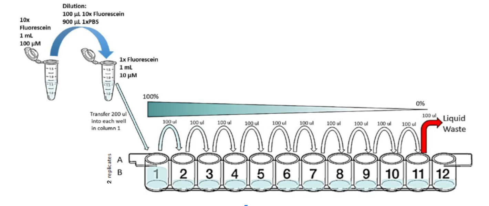

# Multicolor fluorescence per bacterial particle calibration

Plate readers report fluorescence values in arbitrary units that vary widely from instrument to instrument. Therefore absolute fluorescence values cannot be directly compared from one instrument to another. In order to compare fluorescence output of biological devices, it is necessary to create a standard fluorescence curve. This variant of the protocol uses two replicates of three colors of dye, plus beads.
Adapted from [https://dx.doi.org/10.17504/protocols.io.bht7j6rn](https://dx.doi.org/10.17504/protocols.io.bht7j6r) and [https://dx.doi.org/10.17504/protocols.io.6zrhf56](https://dx.doi.org/10.17504/protocols.io.6zrhf56)

## Protocol Outputs:
* Dataset: [multicolor-particle-calibration.xlsx](multicolor-particle-calibration.xlsx)

## Protocol Materials:
* [Cascade Blue](https://pubchem.ncbi.nlm.nih.gov/substance/57269662)
* [Water, sterile-filtered, BioReagent, suitable for cell culture](https://identifiers.org/pubchem.substance:24901740)
* [Fluorescein](https://pubchem.ncbi.nlm.nih.gov/substance/329753341)
* [Phosphate Buffered Saline](https://pubchem.ncbi.nlm.nih.gov/compound/24978514)
* [NanoCym 950 nm monodisperse silica nanoparticles](https://nanocym.com/wp-content/uploads/2018/07/NanoCym-All-Datasheets-.pdf)
* [Sulforhodamine](https://pubchem.ncbi.nlm.nih.gov/compound/139216224)
* stock reagent container (x 6)
* 96 well plate

## Protocol Steps:
1. Provision a container named `Fluorescein calibrant` such as:
	[StockReagent](https://sift.net/container-ontology/container-ontology#StockReagent).
2. Provision a container named `Sulforhodamine 101 calibrant` such as:
	[StockReagent](https://sift.net/container-ontology/container-ontology#StockReagent).
3. Provision a container named `Cascade blue calibrant` such as:
	[StockReagent](https://sift.net/container-ontology/container-ontology#StockReagent).
4. Provision a container named `microspheres` such as:
	[StockReagent](https://sift.net/container-ontology/container-ontology#StockReagent).
5. Provision a container named `molecular grade H2O` such as:
	[StockReagent](https://sift.net/container-ontology/container-ontology#StockReagent).
6. Provision a container named `PBS` such as:
	[StockReagent](https://sift.net/container-ontology/container-ontology#StockReagent).
7. Pipette 500.0 microliter of [Fluorescein](https://pubchem.ncbi.nlm.nih.gov/substance/329753341) into `Fluorescein calibrant`.
8. Pipette 500.0 microliter of [Cascade Blue](https://pubchem.ncbi.nlm.nih.gov/substance/57269662) into `Cascade blue calibrant`.
9. Pipette 500.0 microliter of [Sulforhodamine](https://pubchem.ncbi.nlm.nih.gov/compound/139216224) into `Sulforhodamine 101 calibrant`.
10. Pipette 500.0 microliter of [NanoCym 950 nm monodisperse silica nanoparticles](https://nanocym.com/wp-content/uploads/2018/07/NanoCym-All-Datasheets-.pdf) into `microspheres`.
11. Transfer 1.0 milliliter of `PBS` sample to  stock reagent container `Fluorescein calibrant`. The reconstituted `Fluorescein` should have a final concentration of 10 uM in `Phosphate Buffered Saline`.
12. Vortex `Fluorescein calibrant`.
13. Transfer 1.0 milliliter of `PBS` sample to  stock reagent container `Sulforhodamine 101 calibrant`. The reconstituted `Sulforhodamine` standard will have a final concentration of 2 uM in `Phosphate Buffered Saline`.
14. Vortex `Sulforhodamine 101 calibrant`.
15. Transfer 1.0 milliliter of `molecular grade H2O` sample to  stock reagent container `Cascade blue calibrant`. The reconstituted `Cascade Blue` calibrant will have a final concentration of 10 uM in `Water, sterile-filtered, BioReagent, suitable for cell culture`.
16. Vortex `Cascade blue calibrant`.
17. Transfer 1.0 milliliter of `molecular grade H2O` sample to  stock reagent container `microspheres`. The resuspended `NanoCym 950 nm monodisperse silica nanoparticles` will have a final concentration of 3e9 microspheres/mL in `Water, sterile-filtered, BioReagent, suitable for cell culture`.
18. Vortex `microspheres`.
19. Provision a container named `calibration plate` such as:
	[Plate96Well](https://sift.net/container-ontology/container-ontology#Plate96Well).
20. Transfer 100.0 microliter of `PBS` sample to wells A2:D12 of 96 well plate `calibration plate`.
21. Transfer 100.0 microliter of `molecular grade H2O` sample to wells E2:H12 of 96 well plate `calibration plate`.
22. Transfer 200.0 microliter of `Fluorescein calibrant` sample to wells A1 of 96 well plate `calibration plate`.
23. Transfer 200.0 microliter of `Fluorescein calibrant` sample to wells B1 of 96 well plate `calibration plate`.
24. Transfer 200.0 microliter of `Sulforhodamine 101 calibrant` sample to wells C1 of 96 well plate `calibration plate`.
25. Transfer 200.0 microliter of `Sulforhodamine 101 calibrant` sample to wells D1 of 96 well plate `calibration plate`.
26. Transfer 200.0 microliter of `Cascade blue calibrant` sample to wells E1 of 96 well plate `calibration plate`.
27. Transfer 200.0 microliter of `Cascade blue calibrant` sample to wells F1 of 96 well plate `calibration plate`.
28. Transfer 200.0 microliter of `microspheres` sample to wells G1 of 96 well plate `calibration plate`.
29. Transfer 200.0 microliter of `microspheres` sample to wells H1 of 96 well plate `calibration plate`.
30. Perform a series of 10 2-fold dilutions on wells A1:A11 of 96 well plate `calibration plate`. Start with A1 and end with a final volume of 200.0 microliter in A11.  For each 100.0 microliter transfer, pipette up and down 3X to ensure the dilution is mixed homogeneously.

Serial Dilution

31. Perform a series of 10 2-fold dilutions on wells B1:B11 of 96 well plate `calibration plate`. Start with B1 and end with a final volume of 200.0 microliter in B11.  For each 100.0 microliter transfer, pipette up and down 3X to ensure the dilution is mixed homogeneously.

31. Perform a series of 10 2-fold dilutions on wells B1:B11 of 96 well plate `calibration plate`. Start with B1 and end with a final volume of 200.0 microliter in B11.  For each 100.0 microliter transfer, pipette up and down 3X to ensure the dilution is mixed homogeneously.

32. Perform a series of 10 2-fold dilutions on wells C1:C11 of 96 well plate `calibration plate`. Start with C1 and end with a final volume of 200.0 microliter in C11.  For each 100.0 microliter transfer, pipette up and down 3X to ensure the dilution is mixed homogeneously.
33. Perform a series of 10 2-fold dilutions on wells D1:D11 of 96 well plate `calibration plate`. Start with D1 and end with a final volume of 200.0 microliter in D11.  For each 100.0 microliter transfer, pipette up and down 3X to ensure the dilution is mixed homogeneously.
34. Perform a series of 10 2-fold dilutions on wells E1:E11 of 96 well plate `calibration plate`. Start with E1 and end with a final volume of 200.0 microliter in E11.  For each 100.0 microliter transfer, pipette up and down 3X to ensure the dilution is mixed homogeneously.
35. Perform a series of 10 2-fold dilutions on wells F1:F11 of 96 well plate `calibration plate`. Start with F1 and end with a final volume of 200.0 microliter in F11.  For each 100.0 microliter transfer, pipette up and down 3X to ensure the dilution is mixed homogeneously.
36. Perform a series of 10 2-fold dilutions on wells G1:G11 of 96 well plate `calibration plate`. Start with G1 and end with a final volume of 200.0 microliter in G11.  For each 100.0 microliter transfer, pipette up and down 3X to ensure the dilution is mixed homogeneously.
37. Perform a series of 10 2-fold dilutions on wells H1:H11 of 96 well plate `calibration plate`. Start with H1 and end with a final volume of 200.0 microliter in H11.  For each 100.0 microliter transfer, pipette up and down 3X to ensure the dilution is mixed homogeneously.
38. Discard 100.0 microliter from wells A11:H11 of 96 well plate `calibration plate`.  This step ensures that all wells contain an equivalent volume. Be sure to change pipette tips for every well to avoid cross-contamination.
39. Transfer 100.0 microliter of `PBS` sample to wells A1:D12 of 96 well plate `calibration plate`.  This will bring all wells to volume 200 microliter.
40. Transfer 100.0 microliter of `molecular grade H2O` sample to wells E1:H12 of 96 well plate `calibration plate`.  This will bring all wells to volume 200 microliter.
41. Measure fluorescein and bead fluorescence of `calibration plate` with excitation wavelength of 488.0 nanometer and emission filter of 530.0 nanometer and 30.0 nanometer bandpass.
42. Measure sulforhodamine 101 fluorescence of `calibration plate` with excitation wavelength of 561.0 nanometer and emission filter of 610.0 nanometer and 20.0 nanometer bandpass.
43. Measure cascade blue fluorescence of `calibration plate` with excitation wavelength of 405.0 nanometer and emission filter of 450.0 nanometer and 50.0 nanometer bandpass.
44. Measure absorbance of `calibration plate` at 600.0 nanometer.
45. Import data into the provided Excel file: Dataset: [multicolor-particle-calibration.xlsx](multicolor-particle-calibration.xlsx).

---
Timestamp: 2023-04-06 15:03:01.085054
Protocol version: v1.0a2-114-g57a5f0a

