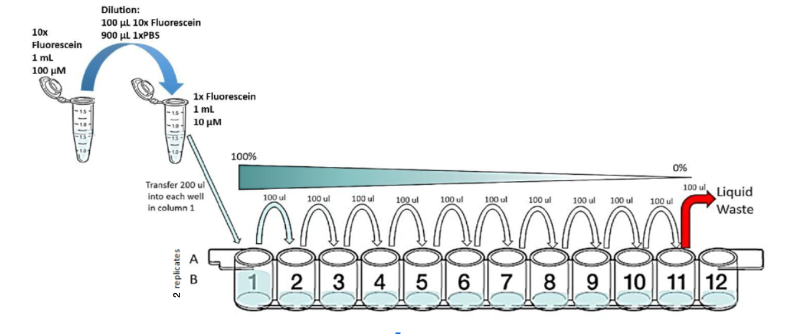

# Fluorescence per bacterial particle calibration

Plate readers report fluorescence values in arbitrary units that vary widely from instrument to instrument. Therefore absolute fluorescence values cannot be directly compared from one instrument to another. In order to compare fluorescence output of biological devices, it is necessary to create a standard fluorescence curve. This variant of the protocol uses two replicates of three colors of dye, plus beads.
Adapted from [https://dx.doi.org/10.17504/protocols.io.bht7j6rn](https://dx.doi.org/10.17504/protocols.io.bht7j6r) and [https://dx.doi.org/10.17504/protocols.io.6zrhf56](https://dx.doi.org/10.17504/protocols.io.6zrhf56).
    This protocol corresponds to ECL protocol "id:M8n3rxnBlZMM".
    

## Protocol Inputs:
* `specification`
* `reagent`
* `reagent_mass`
* `buffer`
* `buffer_volume`
* `buffer_container`
* `source`
* `destination`
* `amount`

## Protocol Outputs:
* Dataset: [single-particle-calibration.xlsx](single-particle-calibration.xlsx)
* `ddh2o_container`
* `samples`
* `microsphere_standard_solution_container`

## Protocol Materials:
* [Water, sterile-filtered, BioReagent, suitable for cell culture](https://identifiers.org/pubchem.substance:24901740)
* [NanoCym 950 nm monodisperse silica nanoparticles](https://nanocym.com/wp-content/uploads/2018/07/NanoCym-All-Datasheets-.pdf)
* stock reagent container
* 50mL stock reagent container
* waste container
* 96 well microplate

## Protocol Steps:
1. Provision a container named `molecular grade H2O` such as: 
	[StockReagent50mL](https://sift.net/container-ontology/container-ontology#StockReagent50mL).
2. Pipette 12.0 milliliter of [Water, sterile-filtered, BioReagent, suitable for cell culture](https://identifiers.org/pubchem.substance:24901740) into `molecular grade H2O`.
3. Provision a container named `microspheres` such as: 
	[StockReagent](https://sift.net/container-ontology/container-ontology#StockReagent).
4. Pipette 2.0 gram of [NanoCym 950 nm monodisperse silica nanoparticles](https://nanocym.com/wp-content/uploads/2018/07/NanoCym-All-Datasheets-.pdf) into `microspheres`.
5. Transfer 1.0 milliliter of `molecular grade H2O` sample to  stock reagent container `microspheres`.
6. Vortex `microspheres`.
7. Provision a container named `discard` such as: 
	[WasteContainer](https://sift.net/container-ontology/container-ontology#WasteContainer).
8. Provision a container named `calibration plate` such as: 
	[Corning96WellPlate360uLFlat](https://sift.net/container-ontology/container-ontology#Corning96WellPlate360uLFlat).
9. Transfer 100.0 microliter of `molecular grade H2O` sample to wells ['A2', 'B1', 'B2', 'C1', 'C2', 'D1', 'E1', 'F1', 'G1', 'H1'] of 96 well microplate `calibration plate`.
10. Transfer 200.0 microliter of `microspheres` sample to wells A1 of 96 well microplate `calibration plate`.
11. Transfer 100.0 microliter of `microspheres` sample to wells D2 of 96 well microplate `calibration plate`.
12. Perform a series of 10 2-fold dilutions on ['A1', 'A2', 'B1', 'B2', 'C1', 'C2', 'D1', 'E1', 'F1', 'G1', 'H1'] 96 well microplate `calibration plate`. Start with A1 and end with a final excess volume of 100.0 microliter in H1.  For each 100.0 microliter transfer, pipette up and down 3X to ensure the dilution is mixed homogeneously.

Serial Dilution

13. Transfer 100.0 microliter of `calibration plate` sample to  waste container `discard`.  This step ensures that all wells contain an equivalent volume. Be sure to change pipette tips for every well to avoid cross-contamination.
14. Measure absorbance of `calibration plate` at 600.0 nanometer.
15. Import data into the provided Excel file: Dataset: [single-particle-calibration.xlsx](single-particle-calibration.xlsx).

---
Timestamp: 2023-06-08 23:22:57.379135
Protocol version: v1.0a2-220-g2702b15

