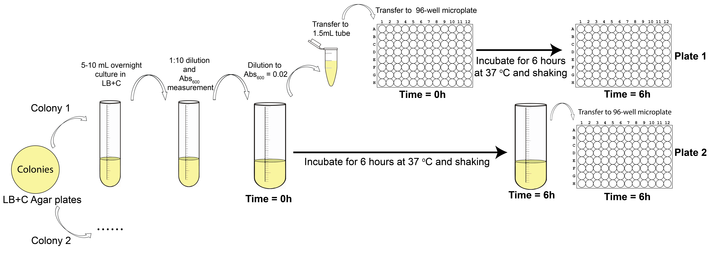
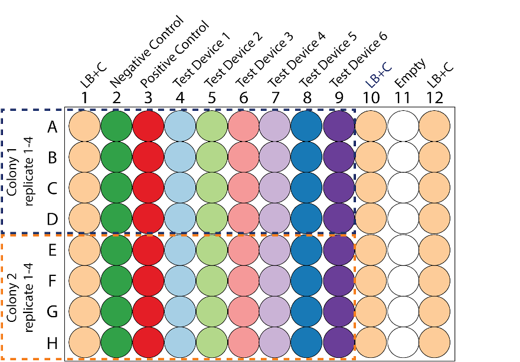

# Experiment 2 - Using the three color calibration protocol: Does the order of transcritional units influence their expression strength?

In this experiment, your team will measure the fluorescence of six devices that encode two fluorescence proteins in two transcriptional units. The devices differ in the order of the transcriptional units. You will calibrate the fluorescence of these devices to the calibrant dyes and the optical density of the culture to the cell density calibrant.

This experiment aims to assess the lab-to-lab reproducibility of the three color calibration protocol when two fluorescent proteins are expressed in the same cell. Besides this technical question, it also adresses a fundamental synthetic biology question: does the order of the transcritional units (that encode for the two different fluorescent proteins) on the devices influence their expression levels?

Before performing the cell measurements, you need to perform all the calibration measurements. Please do not proceed unless you have completed the calibration protocol. Completion of the calibrations will ensure that you understand the measurement process and that you can take the cell measurements under the same conditions. For consistency and reproducibility, we are requiring all teams to use E. coli K-12 DH5-alpha. If you do not have access to this strain, you can request streaks of the transformed devices from another team near you. If you are absolutely unable to obtain the DH5-alpha strain, you may still participate in the InterLab study by contacting the Engineering Committee (engineering [at] igem [dot] org) to discuss your situation.

For all below indicated cell measurements, you must use the same type of plates and the same volumes that you used in your calibration protocol. You must also use the same settings (e.g., filters or excitation and emission wavelengths) that you used in your calibration measurements. If you do not use the same type of plates, volumes, and settings, the measurements will not be valid.

Protocol summary: You will transform the eight devices listed in Table 1 into E. coli K-12 DH5-alpha cells. The next day you will pick two colonies from each transformation (16 total) and use them to inoculate 12 mL overnight cultures (this step is still in tubes). Each of these 16 overnight cultures will be used to inoculate four wells in a 96-well plate (200 microliters each, 4 replicates) for measurement and one test tube (12 mL) for growth. You will measure how fluorescence and optical density develops over 6 hours by taking measurements at time point 0 hour and at time point 6 hours. Follow the protocol below and the visual instructions in Figure 1 and Figure 2.

## Protocol Outputs:
* `baseline absorbance of culture (day 2) measurements of cultures (0 hr timepoint)`
* `0 hr absorbance timepoint measurements of plate 1`
* `0 hr green fluorescence timepoint measurements of plate 1`
* `0 hr blue fluorescence timepoint measurements of plate 1`
* `0 hr red fluorescence timepoint measurements of plate 1`
* `6 hr absorbance timepoint measurements of plate 2`
* `6 hr green fluorescence timepoint measurements of plate 2`
* `6 hr blue fluorescence timepoint measurements of plate 2`
* `6 hr red fluorescence timepoint measurements of plate 2`

## Protocol Materials:
* [_E. coli_ DH5 alpha competent cells](https://identifiers.org/taxonomy:668369)
* [Negative control 2022](http://parts.igem.org/Part:BBa_J428100)
* [Positive control 2022 Green](http://parts.igem.org/Part:BBa_J428112)
* [Positive control red (mCherry) Exp 2](http://parts.igem.org/Part:BBa_J428101)
* [Test Device 1 Exp 2 (Dual construct Green and Blue)](http://parts.igem.org/Part:BBa_J428106)
* [Test Device 2 Exp 2 (Dual construct Green and Red)](http://parts.igem.org/Part:BBa_J428107)
* [Test Device 3 Exp 2 (Dual construct Red and Blue)](http://parts.igem.org/Part:BBa_J428105)
* [Test Device 4 Exp 2 (Dual construct Blue and Red)](http://parts.igem.org/Part:BBa_J428108)
* [Test Device 5 Exp 2 (Dual construct Red and Green)](http://parts.igem.org/Part:BBa_J428104)
* [LB Broth + Chloramphenicol (34 ug/mL)]()
* [LB Agar + Chloramphenicol (34 ug/mL)]()
* [Chloramphenicol stock solution (34 mg/mL)](https://pubchem.ncbi.nlm.nih.gov/compound/5959)
* [Ice]()
* [Plate reader]()
* [Shaking incubator]()
* Petri dish (x 8)
* culture tube (x 32)
* 1.5 mL microfuge tube (x 32)
* 50 ml conical tube (x 16)
* 96 well microplate (x 2)

## Protocol Steps:
1. Obtain 8 x Petri dish containing LB Agar + Chloramphenicol (34 ug/mL) growth medium for culturing `transformant strains`
2. Transform `Negative control 2022` DNA into `_E. coli_ DH5 alpha competent cells`. Repeat for the remaining transformant DNA:  `Positive control 2022 Green`, `Positive control red (mCherry) Exp 2`, `Test Device 1 Exp 2 (Dual construct Green and Blue)`, `Test Device 2 Exp 2 (Dual construct Green and Red)`, `Test Device 3 Exp 2 (Dual construct Red and Blue)`, `Test Device 4 Exp 2 (Dual construct Blue and Red)`, and `Test Device 5 Exp 2 (Dual construct Red and Green)`. Plate transformants on LB Agar + Chloramphenicol (34 ug/mL) `transformant strains` plates. Incubate at 37.0 degree Celsius for 16.0 hour (overnight).
3. Obtain 16 x culture tubes to contain `culture (day 1)`
4. Pick 2 colonies from each `transformant strains` plate.
5. Inoculate 2 colonies of each transformant strains, for a total of 16 cultures. Inoculate each into 5.0 milliliter of LB Broth + Chloramphenicol (34 ug/mL) in culture (day 1) and grow overnight (for 16.0 hour) at 37.0 degree Celsius and 220 rpm.
6. Obtain 16 x culture tubes to contain `culture (day 2)`
7. Dilute each of 16 `culture (day 1)` samples with LB Broth + Chloramphenicol (34 ug/mL) into the culture tube at a 1:10 ratio and final volume of 5.0 milliliter. Maintain at 4.0 degree Celsius while performing dilutions. (This can be also performed on ice).
8. Obtain 16 x 1.5 mL microfuge tubes to contain `cultures (0 hr timepoint)`
9. Hold `cultures (0 hr timepoint)` on ice. This will prevent cell growth while transferring samples.
10. Transfer 1.0 milliliter of each of 16 `culture (day 2)` samples to 1.5 mL microfuge tube containers to contain a total of 16 `cultures (0 hr timepoint)` samples. Maintain at 4.0 degree Celsius during transfer. (This can be also performed on Ice).
11. Measure baseline absorbance of culture (day 2) of `cultures (0 hr timepoint)` at 600.0 nanometer.
12. Obtain 16 x 50 ml conical tubes to contain `back-diluted culture` The conical tube should be opaque, amber-colored, or covered with foil.
13. Back-dilute each of 16 `culture (day 2)` samples to a target OD of 0.02 using LB Broth + Chloramphenicol (34 ug/mL) as diluent to a final volume of 12.0 milliliter. Maintain at 4.0 degree Celsius while performing dilutions.

Fig 1: Visual representation of protocol

14. Obtain 16 x 1.5 mL microfuge tubes to contain `back-diluted culture aliquots`
15. Hold `back-diluted culture aliquots` on ice. This will prevent cell growth while transferring samples.
16. Transfer 1.0 milliliter of each of 16 `back-diluted culture` samples to 1.5 mL microfuge tube containers to contain a total of 16 `back-diluted culture aliquots` samples. Maintain at 4.0 degree Celsius during transfer. (This can be also performed on Ice).
17. Obtain a 96 well microplate to contain `plate 1`
18. Hold `plate 1` on ice.
19. Transfer 200.0 microliter of each `back-diluted culture aliquots` sample to 96 well microplate `plate 1` in the wells indicated in the plate layout.
 Maintain at 4.0 degree Celsius during transfer.
20. Transfer 200.0 microliter of `LB Broth + Chloramphenicol (34 ug/mL)` sample to wells A1:H1, A10:H10, A12:H12 of  96 well microplate `plate 1`. Maintain at 4.0 degree Celsius during transfer. These samples are blanks.

Fig 2: Plate layout

21. Measure 0 hr absorbance timepoint of `plate 1` at 600.0 nanometer.
22. Measure 0 hr green fluorescence timepoint of `plate 1` with excitation wavelength of 488.0 nanometer and emission filter of 530.0 nanometer and 30.0 nanometer bandpass.
23. Measure 0 hr blue fluorescence timepoint of `plate 1` with excitation wavelength of 405.0 nanometer and emission filter of 450.0 nanometer and 50.0 nanometer bandpass.
24. Measure 0 hr red fluorescence timepoint of `plate 1` with excitation wavelength of 561.0 nanometer and emission filter of 610.0 nanometer and 20.0 nanometer bandpass.
25. Incubate all `back-diluted culture` samples for 6.0 hour at 37.0 degree Celsius at 220 rpm.
26. Hold all `back-diluted culture` samples on ice. This will inhibit cell growth during the subsequent pipetting steps.
27. Obtain a 96 well microplate to contain `plate 2`
28. Hold `plate 2` on ice.
29. Transfer 200.0 microliter of each `back-diluted culture` sample to 96 well microplate `plate 2` in the wells indicated in the plate layout.
 Maintain at 4.0 degree Celsius during transfer.
30. Transfer 200.0 microliter of `LB Broth + Chloramphenicol (34 ug/mL)` sample to wells A1:H1, A10:H10, A12:H12 of  96 well microplate `plate 2`. Maintain at 4.0 degree Celsius during transfer. These are the blanks.
31. Measure 6 hr absorbance timepoint of `plate 2` at 600.0 nanometer.
32. Measure 6 hr green fluorescence timepoint of `plate 2` with excitation wavelength of 485.0 nanometer and emission filter of 530.0 nanometer and 30.0 nanometer bandpass.
33. Measure 6 hr blue fluorescence timepoint of `plate 2` with excitation wavelength of 405.0 nanometer and emission filter of 450.0 nanometer and 50.0 nanometer bandpass.
34. Measure 6 hr red fluorescence timepoint of `plate 2` with excitation wavelength of 561.0 nanometer and emission filter of 610.0 nanometer and 20.0 nanometer bandpass.
35. Import data for `baseline absorbance of culture (day 2) measurements of cultures (0 hr timepoint)`, `0 hr absorbance timepoint measurements of plate 1`, `0 hr green fluorescence timepoint measurements of plate 1`, `0 hr blue fluorescence timepoint measurements of plate 1`, `0 hr red fluorescence timepoint measurements of plate 1`, `6 hr absorbance timepoint measurements of plate 2`, `6 hr green fluorescence timepoint measurements of plate 2`, `6 hr blue fluorescence timepoint measurements of plate 2`, `6 hr red fluorescence timepoint measurements of plate 2` into provided Excel file.
---
Timestamp: 2022-07-02 13:07:36.584818---
Protocol version: 1.1b